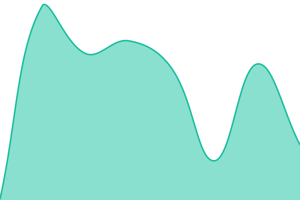

# [📈 Live Status](https://status.17labs.ai): <!--live status--> **🟩 All systems operational**

This repository contains the open-source uptime monitor and status page for [Upptime](https://upptime.js.org), powered by [Upptime](https://github.com/upptime/upptime).

With [Upptime](https://upptime.js.org), you can get your own unlimited and free uptime monitor and status page, powered entirely by a GitHub repository. We use [Issues](https://github.com/upptime/upptime/issues) as incident reports, [Actions](https://github.com/17labs-ai/status/actions) as uptime monitors, and [Pages](https://status.17labs.ai) for the status page.

<!--start: status pages-->
<!-- This summary is generated by Upptime (https://github.com/upptime/upptime) -->
<!-- Do not edit this manually, your changes will be overwritten -->
<!-- prettier-ignore -->
| URL | Status | History | Response Time | Uptime |
| --- | ------ | ------- | ------------- | ------ |
|  [17labs — Web](https://17labs.ai) | 🟩 Up | [17labs-web.yml](https://github.com/17labs-ai/status-page/commits/HEAD/history/17labs-web.yml) | 

 296ms
     
 | 

<a href="https://status.17labs.ai/history/17labs-web">100.00%</a>
    

|  [Dealya — Web](https://dealya.ai) | 🟩 Up | [dealya-web.yml](https://github.com/17labs-ai/status-page/commits/HEAD/history/dealya-web.yml) | 

 16ms
     
 | 

<a href="https://status.17labs.ai/history/dealya-web">100.00%</a>
    

|  [Flashcards — Web](https://deckweave.17labs.ai) | 🟩 Up | [flashcards-web.yml](https://github.com/17labs-ai/status-page/commits/HEAD/history/flashcards-web.yml) | 

 119ms
     
 | 

<a href="https://status.17labs.ai/history/flashcards-web">100.00%</a>
    

|  [Flashcards — API (Health)](https://mcp-flashcards.17labs.ai/health) | 🟩 Up | [flashcards-api-health.yml](https://github.com/17labs-ai/status-page/commits/HEAD/history/flashcards-api-health.yml) | 

 559ms
     
 | 

<a href="https://status.17labs.ai/history/flashcards-api-health">100.00%</a>
    

|  [Flashcards — Login (Health)](https://sso.17labs.ai/auth/realms/flashcards/protocol/openid-connect/auth?client_id=flashcards-gpt-app-client&redirect_uri=https%3A%2F%2Fchatgpt.com%2Fconnector_platform_oauth_redirect&response_type=code&scope=openid) | 🟩 Up | [flashcards-login-health.yml](https://github.com/17labs-ai/status-page/commits/HEAD/history/flashcards-login-health.yml) | 

 549ms
     
 | 

<a href="https://status.17labs.ai/history/flashcards-login-health">100.00%</a>
    

<!--end: status pages-->

[**Visit our status website →**](https://status.17labs.ai)

## 📄 License

- Powered by: [Upptime](https://github.com/upptime/upptime)
- Code: [MIT](./LICENSE) © [Anand Chowdhary](https://anandchowdhary.com), supported by [Pabio](https://pabio.com)
- Data in the `./history` directory: [Open Database License](https://opendatacommons.org/licenses/odbl/1-0/)
