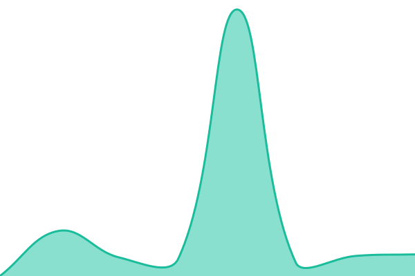
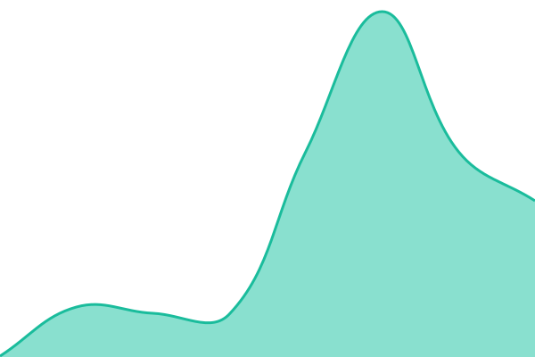
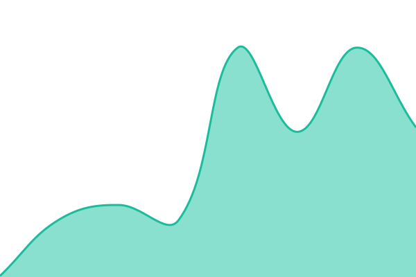
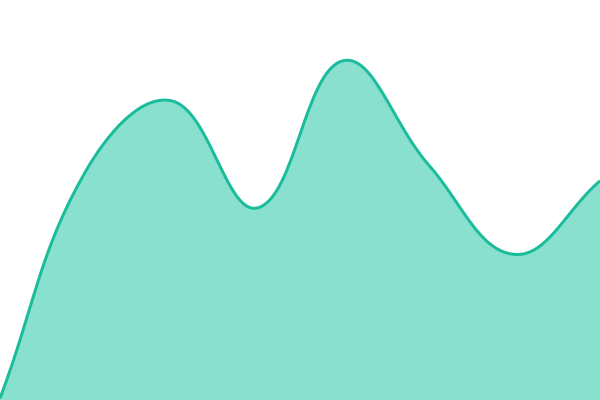
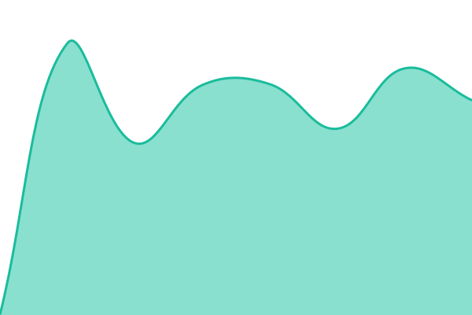
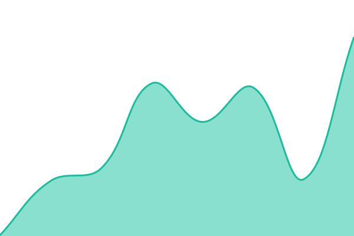
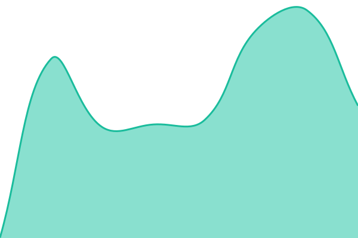

# [📈 Live Status](https://status.17labs.ai): <!--live status--> **🟩 All systems operational**

This repository contains the open-source uptime monitor and status page for [Upptime](https://upptime.js.org), powered by [Upptime](https://github.com/upptime/upptime).

With [Upptime](https://upptime.js.org), you can get your own unlimited and free uptime monitor and status page, powered entirely by a GitHub repository. We use [Issues](https://github.com/upptime/upptime/issues) as incident reports, [Actions](https://github.com/17labs-ai/status/actions) as uptime monitors, and [Pages](https://status.17labs.ai) for the status page.

<!--start: status pages-->
<!-- This summary is generated by Upptime (https://github.com/upptime/upptime) -->
<!-- Do not edit this manually, your changes will be overwritten -->
<!-- prettier-ignore -->
| URL | Status | History | Response Time | Uptime |
| --- | ------ | ------- | ------------- | ------ |
|  [17labs — Landing](https://17labs.ai) | 🟩 Up | [17labs-landing.yml](https://github.com/17labs-ai/status-page/commits/HEAD/history/17labs-landing.yml) | 

 366ms
     
 | 

<a href="https://status.17labs.ai/history/17labs-landing">100.00%</a>
    

|  [CCAR-F Academy — Landing](https://ccar-f.17labs.ai) | 🟩 Up | [ccar-f-academy-landing.yml](https://github.com/17labs-ai/status-page/commits/HEAD/history/ccar-f-academy-landing.yml) | 

 181ms
     
 | 

<a href="https://status.17labs.ai/history/ccar-f-academy-landing">100.00%</a>
    

|  [Dealya — Landing](https://dealya.ai) | 🟩 Up | [dealya-landing.yml](https://github.com/17labs-ai/status-page/commits/HEAD/history/dealya-landing.yml) | 

 201ms
     
 | 

<a href="https://status.17labs.ai/history/dealya-landing">100.00%</a>
    

|  [PandaFind — Landing](https://pandafind.app) | 🟩 Up | [panda-find-landing.yml](https://github.com/17labs-ai/status-page/commits/HEAD/history/panda-find-landing.yml) | 

 157ms
     
 | 

<a href="https://status.17labs.ai/history/panda-find-landing">100.00%</a>
    

|  [TaskNotify — Landing](https://tasknotify.app) | 🟩 Up | [task-notify-landing.yml](https://github.com/17labs-ai/status-page/commits/HEAD/history/task-notify-landing.yml) | 

 226ms
     
 | 

<a href="https://status.17labs.ai/history/task-notify-landing">100.00%</a>
    

|  [TaskNotify — Login](https://sso.17labs.ai/auth/realms/tasknotify/protocol/openid-connect/auth?client_id=tasknotify-gpt-app-client&redirect_uri=https%3A%2F%2Fchatgpt.com%2Fconnector_platform_oauth_redirect&response_type=code&scope=openid) | 🟩 Up | [task-notify-login.yml](https://github.com/17labs-ai/status-page/commits/HEAD/history/task-notify-login.yml) | 

 704ms
     
 | 

<a href="https://status.17labs.ai/history/task-notify-login">100.00%</a>
    

|  [Flashcards — Landing](https://deckweave.17labs.ai) | 🟩 Up | [flashcards-landing.yml](https://github.com/17labs-ai/status-page/commits/HEAD/history/flashcards-landing.yml) | 

 212ms
     
 | 

<a href="https://status.17labs.ai/history/flashcards-landing">100.00%</a>
    

|  [Flashcards — Login](https://sso.17labs.ai/auth/realms/flashcards/protocol/openid-connect/auth?client_id=flashcards-gpt-app-client&redirect_uri=https%3A%2F%2Fchatgpt.com%2Fconnector_platform_oauth_redirect&response_type=code&scope=openid) | 🟩 Up | [flashcards-login.yml](https://github.com/17labs-ai/status-page/commits/HEAD/history/flashcards-login.yml) | 

 459ms
     
 | 

<a href="https://status.17labs.ai/history/flashcards-login">100.00%</a>
    

<!--end: status pages-->

[**Visit our status website →**](https://status.17labs.ai)

## 📄 License

- Powered by: [Upptime](https://github.com/upptime/upptime)
- Code: [MIT](./LICENSE) © [Anand Chowdhary](https://anandchowdhary.com), supported by [Pabio](https://pabio.com)
- Data in the `./history` directory: [Open Database License](https://opendatacommons.org/licenses/odbl/1-0/)
